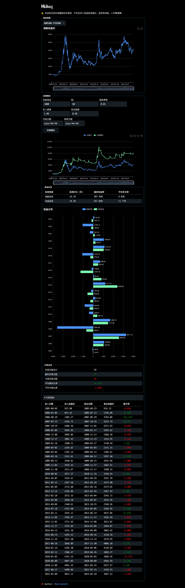

<p align="center">

</p>

<p align="center">
<i>Midas</i> is a free and open source <i>Moving Average Trading</i> backtest simulator
</p>

Bilibili Video: [https://www.bilibili.com/video/BV11o4y1B7fL](https://www.bilibili.com/video/BV11o4y1B7fL)

> [!CAUTION]
>
> Investment risks should be considered carefully when entering the market.
>
> This project does NOT provide investment advice to anyone.

## 🚀 How to run

### 1. Run `midas-http`

```bash
cargo run --bin midas-http
```

### 2. Run `midas-web`

```bash
cd midas-web
yarn
yarn dev
```

### ?. Optional

You can update Index Data using `midas-spider`

```bash
cargo run --bin midas-spider
```

## 📄 License

[GNU Affero General Public License v3.0](https://choosealicense.com/licenses/agpl-3.0)

## Screenshot


